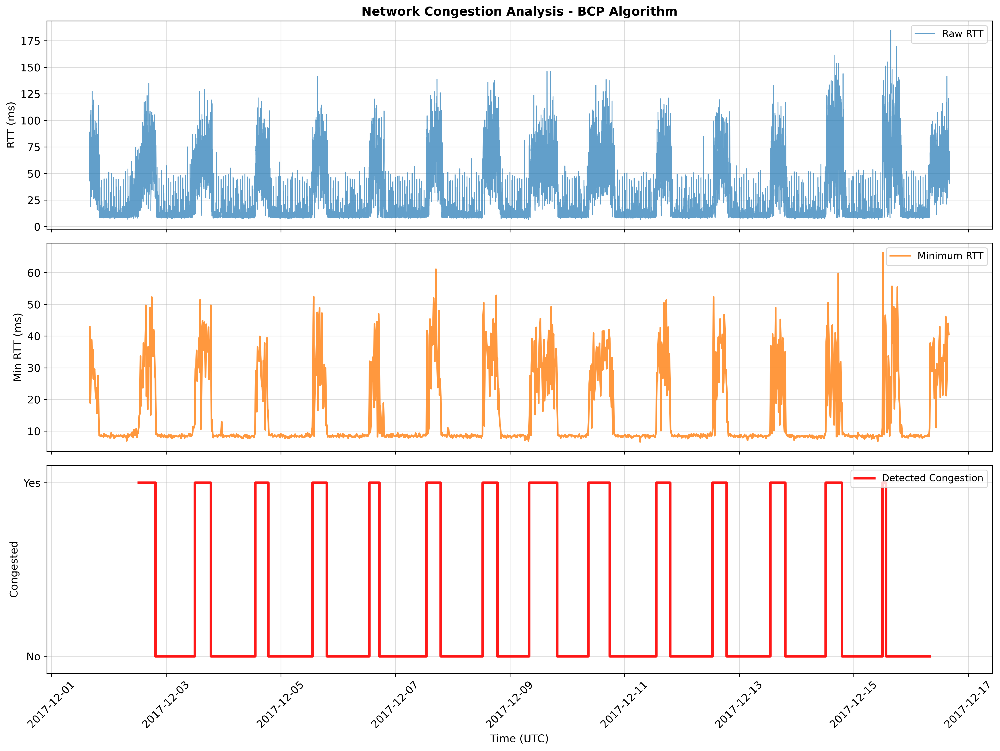

# The PAM 2022 dataset

The RTT series analyzed in *Jitterbug: A New Framework for Jitter-Based Congestion
Inference* (PAM 2022), with the congestion periods the paper reports on it. It is the
reference input for the tests (`tests/test_paper_regression.py`) and for every example.

## Files

| File | Content |
| --- | --- |
| `data/raw.csv` | 47 163 RTT samples over 15 days (1 – 16 December 2017), `epoch,values`, bursty sampling (27.5 s on average, gaps up to 197 s; see `jitterbug validate --verbose`) with a daily congestion episode. Follows [docs/INPUT_FORMATS.md](../../docs/INPUT_FORMATS.md). |
| `data/mins.csv` | Minimum RTT per 15-minute interval, as computed by the 1.x scripts. Kept for reference and for the notebooks' plots; Jitterbug recomputes it from `raw.csv`. |
| `expected_results/jd_inferences.csv` | The paper's periods with the jitter-dispersion method: `starts,ends,congestion` (epoch seconds, 1 = congested). 29 periods, 15 congested. |
| `expected_results/kstest_inferences.csv` | Same with the KS test. 29 periods, 15 congested. |
| `plots/` | Figures and text summaries for both detectors, regenerated with `uv run python tools/generate_visualizations.py`. |
| `basic_analysis.py` | Library usage end to end; writes `results/` (not committed). |

## Run it

```bash
uv run jitterbug validate examples/network_analysis/data/raw.csv --verbose
uv run jitterbug analyze  examples/network_analysis/data/raw.csv --output results.json
uv run jitterbug analyze  examples/network_analysis/data/raw.csv --algorithm bcp --method ks_test
uv run python examples/network_analysis/basic_analysis.py
```

```python
from jitterbug import JitterbugAnalyzer, JitterbugConfig

analyzer = JitterbugAnalyzer(JitterbugConfig())
results = analyzer.analyze_from_file("examples/network_analysis/data/raw.csv")

for period in results.get_congested_periods():
    print(period.start_timestamp, period.end_timestamp, period.confidence)
print(analyzer.get_summary_statistics(results))
```

## What Jitterbug finds on it

| Configuration | Periods | Congested | Paper's periods recovered | Spurious |
| --- | --- | --- | --- | --- |
| `--algorithm bcp --method ks_test` (the paper's) | 28 | 14 | 14 / 15 | 0 |
| `--algorithm ruptures` (default) + jitter dispersion | 22 | 11 | 11 / 15 | 0 |

"Recovered" means a detected congested period overlaps the reference one. Interval
boundaries differ from the 1.x implementation by a few minutes (different change point
back ends), so counts and overlap are what the regression tests pin, not exact
timestamps. Timestamps in the output are UTC.



## Comparing with the reference

`expected_results/*.csv` use the same `starts,ends,congestion` layout as
`jitterbug analyze --output-format csv`, so the two can be joined on time:

```bash
uv run jitterbug analyze examples/network_analysis/data/raw.csv \
    --algorithm bcp --method ks_test --output results.csv --output-format csv
```

```python
import pandas as pd

ours = pd.read_csv("results.csv")
theirs = pd.read_csv("examples/network_analysis/expected_results/kstest_inferences.csv")
```

`tests/test_paper_regression.py::_agreement` shows the overlap computation used in CI.
